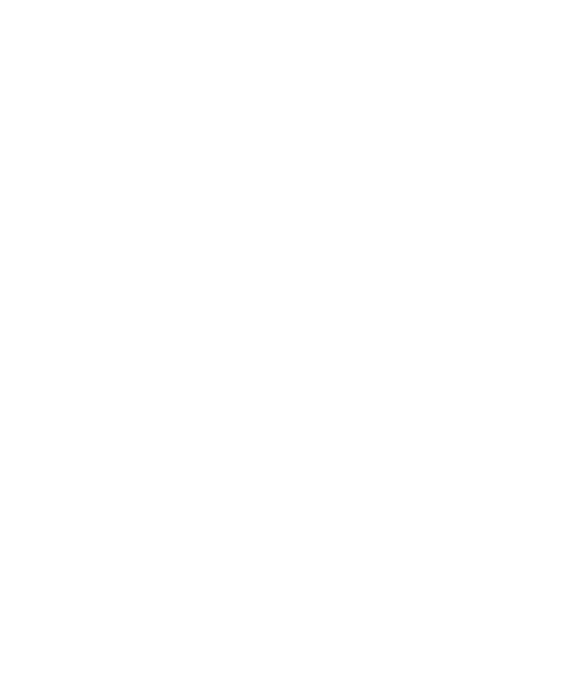

---
# You can also start simply with 'default'
theme: seriph
addons:
  - slidev-addon-asciinema
# random image from a curated Unsplash collection by Anthony
# like them? see https://unsplash.com/collections/94734566/slidev
background: https://cover.sli.dev
# some information about your slides (markdown enabled)
title: Simplifiez la gestion de vos environnements de développement avec devenv !
info: |
  ## Slidev Starter Template
  Presentation slides for developers.

  Learn more at [Sli.dev](https://sli.dev)
# apply unocss classes to the current slide
class: text-center
# https://sli.dev/features/drawing
drawings:
  persist: false
# slide transition: https://sli.dev/guide/animations.html#slide-transitions
transition: slide-left
# enable MDC Syntax: https://sli.dev/features/mdc
mdc: true
# take snapshot for each slide in the overview
overviewSnapshots: true

---

# Simplifiez la gestion de vos environnements de développement avec devenv !


---
layout: center
class: text-center
---

# Il y a bien longtemps

<v-clicks>

- Readme.md de 873 lignes pour l'install compatible uniquement debian 6
- Machine virtuelle fournie par l'équipe infra

</v-clicks>

---
layout: image

image: img/cry.gif
backgroundSize: contain
---


---
layout: center
class: text-center
---

# Il y a un peu moins longtemps

rvm, nvm, pyenv, ...

<v-clicks>

- On peut enfin avoir plusieurs version de langages sur sa machine !
- Mais on doit encore gérer les dépendances système, les services (postgres, redis, ...).
- Et il faut installer le gestionnaire de version pour chaque langage

</v-clicks>


---
layout: image

image: img/noice.gif
backgroundSize: contain
---

---
layout: center
class: text-center
---

# Maintenant


<div class="flex justify-center">
  
</div>

<v-clicks>

- On isole les dépendances sans avoir à sacrifier les performances 
- On peut piocher dans tout un catalogue d'image préconfigurée pour démarer rapidement
- On peut se baser sur celles ci si besoin de configurer plus d'éléments
- On orchestre tout ça avec docker-compose
</v-clicks>


---
layout: image

image: img/head-explosion.gif
backgroundSize: contain
---


---
layout: center
class: text-center
---


- On isole les dépendances <span v-mark.crossed-off.red >sans avoir à sacrifier les performances</span> <v-click>(coucou mac 👋)</v-click> 
<v-clicks>

- Problématiques lorsque certains outils s'attendent à avoir plusieurs runtime disponible
- On se retrouve à écrire nos commandes dans un shell tout moche alors qu'on a tuné notre .(bash|zsh)rc pour qu'il corresponde exactement à nos besoins
- On écrit notre besoin (impératif) au lieu de le décrire (déclaratif)

</v-clicks> 


---
layout: image

image: img/what-if.jpg
backgroundSize: contain
---

---
layout: two-cols
---

<div class="flex items-center" >


# Loïc BOURG

</div>


## Lead technique


::right::




---
---

````md magic-move {lines: true}
```nix
# devenv.nix
{ pkgs, lib, config, inputs, ... }:

{
  languages.javascript = {
    enable = true;
    package = pkgs.nodejs_18;
  };
}
```

```nix {10-13}
# devenv.nix
{ pkgs, lib, config, inputs, ... }:

{
  languages.javascript = {
    enable = true;
    package = pkgs.nodejs_18;
  };

  languages.ruby =  {
    enable = true;
    package = pkgs.ruby_3_3;
  };
}
```
````

---
---

<Asciinema src="casts/ruby.cast" :playerProps="{speed: 2}" />

---
---

# Comment ca marche ?

- Outils basé sur nix
- Utilise les dépendances disponible sur nixpkgs

---
layout: image
image: img/nix1.png
backgroundSize: contain
---

---
layout: image
image: img/pure2.png
backgroundSize: contain
---


---
---

````md magic-move {lines: true}
```nix
# devenv.nix
{ pkgs, lib, config, inputs, ... }:

{
  languages.javascript = {
    enable = true;
    package = pkgs.nodejs_20;
  };

  languages.ruby =  {
    enable = true;
    package = pkgs.ruby_3_3;
  };
}
```

```nix {15-18}
# devenv.nix
{ pkgs, lib, config, inputs, ... }:

{
  languages.javascript = {
    enable = true;
    package = pkgs.nodejs_20;
  };

  languages.ruby =  {
    enable = true;
    package = pkgs.ruby_3_3;
  };

  services.postgres = {
    enable = true;
    package = pkgs.postgresql_16;
  };
}
```
````

---
---

<video controls src="./video/postgres.webm" />

---
---

````md magic-move {lines: true}

```nix {15-18}
# devenv.nix
{ pkgs, lib, config, inputs, ... }:

{
  languages.javascript = {
    enable = true;
    package = pkgs.nodejs_20;
  };

  languages.ruby =  {
    enable = true;
    package = pkgs.ruby_3_3;
  };

  services.postgres = {
    enable = true;
    package = pkgs.postgresql_16;
  };
}
```

```nix {20-22}
# devenv.nix
{ pkgs, lib, config, inputs, ... }:

{
  languages.javascript = {
    enable = true;
    package = pkgs.nodejs_20;
  };

  languages.ruby =  {
    enable = true;
    package = pkgs.ruby_3_3;
  };

  services.postgres = {
    enable = true;
    package = pkgs.postgresql_16;
  };

  processes.node-http-server = {
    exec = "node server.js";
  }
}
```

````

---
---

<video controls src="./video/node-server.webm" />

---
layout: two-cols-header
---


# Conclusion

::left::
## Avantages
- Déclaratif
- Beaucoup de langages (54) et services (32) supportés 
- Isolé tout en restant sur sa machine
- Compatible linux + mac
- 100 % reproductible
- Facile à utiliser
- Rapide 

::right::
## Problématiques

- Outil assez récent (réécriture en rust en mars 2024)
- Communauté nix fragmentée
- Peu nécessiter d'apprendre nix si on sort du cas d'usage 


---
layout: center
---

# Questions ?